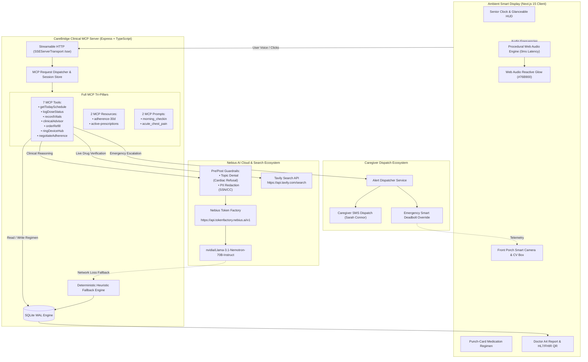

# CareBridge Ambient OS — System Architecture & Operational Blueprint

> **Comprehensive Technical Architecture & System Specification**  
> *Prepared for the Nebius x NVIDIA AI Challenge Evaluation Committee, Systems Engineers, and Clinical Informaticists.*

---

## Table of Contents

1. [Executive Overview & Geriatric Clinical Mission](#1-executive-overview--geriatric-clinical-mission)
2. [High-Level System Topology & Data Flow](#2-high-level-system-topology--data-flow)
3. [Repository Anatomy & Technical Boundaries](#3-repository-anatomy--technical-boundaries)
4. [Model Context Protocol (MCP) Tri-Pillar Architecture](#4-model-context-protocol-mcp-tri-pillar-architecture)
5. [AI Reasoning & Nebius Token Factory Pipeline](#5-ai-reasoning--nebius-token-factory-pipeline)
6. [Live Clinical Verification via Tavily Search API ($3,000 Award)](#6-live-clinical-verification-via-tavily-search-api-3000-award)
7. [Ambient Smart Display Ergonomics & Hardware Emulation](#7-ambient-smart-display-ergonomics--hardware-emulation)
8. [Dual-Turn Mock Voice Dialogue Simulator](#8-dual-turn-mock-voice-dialogue-simulator)
9. [Database Architecture & SQLite WAL Persistence](#9-database-architecture--sqlite-wal-persistence)
10. [Automated Testing & Clinical Verification](#10-automated-testing--clinical-verification)
11. [Deployment, Quickstart & Environment Setup](#11-deployment-quickstart--environment-setup)

---

## 1. Executive Overview & Geriatric Clinical Mission

### 1.1 The Clinical Challenge: Geriatric Polypharmacy & Cognitive Vulnerability
Globally, older adults aged 70 and above living independently experience high rates of **multimorbidity** requiring simultaneous management of 5 or more prescription medications (**polypharmacy**). In geriatric care, this creates acute failure modes:
- **Accidental Omission & Double-Dosing:** Short-term memory lapses and small prescription bottle typography lead to frequent dosing errors.
- **Lethal Drug-Drug Interactions (DDIs):** Combining common over-the-counter NSAIDs (e.g., Ibuprofen) with anticoagulants (e.g., Warfarin) can trigger catastrophic gastrointestinal or intracranial hemorrhages.
- **Fine-Motor & Cognitive Accessibility Barriers:** Conventional smartphone apps with multi-level menus, small touch targets, and complex navigation create friction for seniors suffering from essential tremors, Parkinson's disease, or macular degeneration.
- **Caregiver Anxiety & Asynchronous Monitoring:** Remote adult children balance full-time careers while constantly worrying about their aging parents' medication compliance.

### 1.2 The CareBridge Solution
**CareBridge Ambient OS** reimagines ambient smart displays as proactive, glanceable healthcare stations:
- **10-Foot Glanceable UX (6-Foot Bedside Rule):** High-contrast typography conforming to WCAG AAA standards, bold visual countdowns, and punch-card medication layouts.
- **One-Tap Dignity Confirmation:** Oversized (56px+) tremor-tolerant touch targets (`"I TOOK MY PILL"`) with instant celebratory audio-visual feedback.
- **Autonomous Multi-Agent AI Core:** Powered by open-weights **`nvidia/Llama-3.1-Nemotron-70B-Instruct`** hosted on high-throughput **Nebius Token Factory** endpoints, coupled with the **Model Context Protocol (MCP)** and real-time medical verification via **Tavily Search API**.

```
┌──────────────────────────────────────────────────────────────────────────┐
│                   CAREBRIDGE AMBIENT ECOSYSTEM ARCHITECTURE              │
└───────────────────────────────────┬──────────────────────────────────────┘
                                    │
       ┌────────────────────────────┴─────────────────────────────┐
       ▼                                                           ▼
┌──────────────────────────────────────┐       ┌──────────────────────────────────────┐
│        BEDSIDE SMART DISPLAY         │       │          REMOTE CAREGIVER            │
│       (Ambient Web Terminal)         │       │          (Sarah Connor)              │
│  - 6-Foot Glanceable Bedside UI      │       │  - Real-time Adherence Telemetry     │
│  - Reactive NVIDIA Green Light Bar   │       │  - Vitals & Anomaly Notifications    │
│  - One-Tap Dose Confirmation         │       │  - Urgent SMS & Webhook Dispatch     │
│  - Multimodal Interactive Cards      │       │  - Adherence Negotiation Supervision │
│  - Smart IoT Porch Camera & Deadbolt │       │  - 1-Click A4 Certified Doctor Audit │
└──────────────────┬───────────────────┘       └──────────────────┬───────────────────┘
                   │                                              │
                   └──────────────────────┬───────────────────────┘
                                          │
                                          ▼
┌─────────────────────────────────────────────────────────────────────────────────────┐
│                       BACKEND CLINICAL AGENTIC CORE (MCP)                           │
│  - Model Context Protocol (MCP): Tools (7), Resources (2), Prompts (2)              │
│  - Nebius Token Factory: NVIDIA Nemotron-70B Tool-Use + Guardrails + Streaming SSE  │
│  - Tavily Search API: Real-Time FDA & Clinical Drug Interaction Grounding           │
│  - 15-Drug Beers Criteria Geriatric Pharmacology Registry (20 Safety Rules)         │
│  - SQLite eMAR Storage (better-sqlite3 WAL) with Resilient Offline Fallback Engine  │
└─────────────────────────────────────────────────────────────────────────────────────┘
```

---

## 2. High-Level System Topology & Data Flow



---

## 3. Repository Anatomy & Technical Boundaries

CareBridge is architected as an atomic monorepo with distinct separation of concerns:

```text
carebridge-nemotron/
├── backend-mcp/                     # BACKEND MCP & NEBIUS/NVIDIA ENGINE
│   ├── src/
│   │   ├── ai/                      # AI Client & Inference Pipeline
│   │   │   ├── nebiusClient.ts      # Nebius Token Factory (NVIDIA Nemotron-70B) Client
│   │   │   └── voiceClient.ts       # Ambient Voice Synthesis Service
│   │   ├── config/
│   │   │   └── env.ts               # Typed Environment Variables & Validation
│   │   ├── database/                # SQLite WAL Persistence Layer
│   │   │   ├── db.ts                # better-sqlite3 Connection & Schema Migration
│   │   │   ├── medicineRepo.ts      # Prescription Catalog & Inventory Management
│   │   │   ├── logRepo.ts           # Dose Administration Event Store
│   │   │   ├── vitalsRepo.ts        # Longitudinal Biometrics Repository
│   │   │   ├── caregiverRepo.ts     # Caregiver Contact & Profile Registry
│   │   │   └── seedDemoData.ts      # 30-Day Clinical Dataset Generator
│   │   ├── prompts/                 # MCP Pillar 3: Registered Clinical Prompts
│   │   │   └── index.ts             # morning_medication_checkin & acute_chest_pain_triage
│   │   ├── resources/               # MCP Pillar 2: Direct Clinical Data URIs
│   │   │   └── index.ts             # carebridge://patient/.../adherence-30d & active
│   │   ├── services/                # Domain & Clinical Services
│   │   │   ├── drugInteractionService.ts # Beers Criteria & Tavily Search API Client
│   │   │   └── alertDispatcher.ts   # Emergency SMS & Webhook Dispatcher
│   │   ├── tools/                   # MCP Pillar 1: Clinical Action Tools
│   │   │   ├── agentTurnHandler.ts  # Multi-Turn Orchestration & Heuristic Fallback
│   │   │   ├── clinicalAdvisor.ts   # Nemotron-70B Clinical Triage Tool
│   │   │   ├── getTodaySchedule.ts  # Regimen Query & Adherence Percentage Tool
│   │   │   ├── logDoseStatus.ts     # Dose Confirmation & Inventory Decrement Tool
│   │   │   ├── orderRefill.ts       # Smart Pharmacy 1-Click Refill Tool
│   │   │   ├── ringDeviceHub.ts     # Smart IoT Hub & Paramedic Unlock Tool
│   │   │   └── negotiateAdherence.ts# Empathetic AI Negotiation & Escalation Tool
│   │   ├── types/
│   │   │   └── index.ts             # Shared Domain Entities & MCP Interfaces
│   │   ├── utils/
│   │   │   └── dateUtils.ts         # Clinical Timezone & Date Formatting Utilities
│   │   └── server.ts                # Model Context Protocol SSE Server Entrypoint
│   └── tests/                       # 67 Automated Vitest Test Cases
│       ├── nemotronEnterprise.test.ts # Nebius & Nemotron-70B Pipeline Tests
│       ├── agentTurn.test.ts        # Conversational Turn & Circuit-Breaker Tests
│       ├── beersCriteria.test.ts    # 15-Drug Pharmacology Registry Tests
│       ├── mcpResourcesPrompts.test.ts # MCP Protocol Conformance Tests
│       ├── mcpTools.test.ts         # Tool Execution Unit Tests
│       ├── offlineFallback.test.ts  # Zero-Network Resilient Fallback Tests
│       └── regression.test.ts       # End-to-End Clinical Flow Regression Tests
│
├── frontend/                        # AMBIENT SMART DISPLAY (Next.js 15)
│   ├── src/
│   │   ├── app/                     # Next.js App Router Structure
│   │   ├── components/
│   │   │   ├── RichCards/           # Interactive Multimodal Display Cards
│   │   │   │   ├── ClinicalAdviceCard.tsx      # Triage advice & alert dispatch banner
│   │   │   │   ├── FrontDoorCameraCard.tsx     # Porch camera & CV package tracking
│   │   │   │   ├── GuardianNegotiationCard.tsx # Empathetic persona negotiation
│   │   │   │   ├── PillVisualCard.tsx          # High-resolution pill visual verification
│   │   │   │   └── PrescriptionOrderCard.tsx   # Smart pharmacy refill confirmation
│   │   │   ├── AgentConsole.tsx     # Reasoning timeline & quick prompt chips
│   │   │   ├── AmbientGlow.tsx      # Web Audio reactive NVIDIA green aura (#76B900)
│   │   │   ├── AuthGate.tsx         # 1-Click evaluator pass & patient switcher
│   │   │   ├── DemoVoiceModal.tsx   # Dual-turn mock voice dialogue simulator
│   │   │   ├── DoctorReportPreviewModal.tsx # Hospital A4 preview & FHIR QR code
│   │   │   ├── MedicationPunchCard.tsx      # Oversized dose confirmation targets
│   │   │   └── SeniorClock.tsx      # 10-foot glanceable time HUD
│   │   ├── hooks/                   # Custom React Hooks
│   │   │   ├── useAmbientAgent.ts   # Voice agent coordination hook
│   │   │   ├── useMedicines.ts      # Medication inventory state hook
│   │   │   └── useHeatmap.ts        # 30-day adherence matrix hook
│   │   └── services/
│   │       ├── speechService.ts     # Speech synthesis & analyser service
│   │       └── soundFxService.ts    # Procedural zero-asset Web Audio earcons
│
├── ARCHITECTURE.md                  # This Technical Architecture Document
├── DEMO_SCRIPT_3MIN.md              # 3-Minute Video Walkthrough Script
├── FRICTION_LOG.md                  # Nebius Token Factory DX Feedback & Friction Log
└── LICENSE                          # MIT Open Source License
```

---

## 4. Model Context Protocol (MCP) Tri-Pillar Architecture

CareBridge strictly implements the official Model Context Protocol specification over **Streamable HTTP Server-Sent Events (SSE)** (`/sse` and `/message`).

```
                    ┌───────────────────────────────────────────────┐
                    │          CareBridge MCP Server                │
                    │   Streamable HTTP (SSEServerTransport /sse)   │
                    └──────┬────────────────┬───────────────┬───────┘
                           │                │               │
          ┌────────────────▼─────────┐      │      ┌────────▼────────────────┐
          │        MCP TOOLS         │      │      │       MCP PROMPTS       │
          ├──────────────────────────┤      │      ├─────────────────────────┤
          │ • getTodaySchedule       │      │      │ • morning_medication_   │
          │ • logDoseStatus          │      │      │   checkin               │
          │ • recordVitals           │      │      │ • acute_chest_pain_     │
          │ • clinicalAdvisor        │      │      │   triage                │
          │ • orderRefill            │      │      └─────────────────────────┘
          │ • ringDeviceHub          │      │
          │ • negotiateAdherence     │      │
          └──────────────────────────┘      │
                                 ┌──────────▼──────────────┐
                                 │      MCP RESOURCES      │
                                 ├─────────────────────────┤
                                 │ • carebridge://patient/ │
                                 │   eleanor-vance/        │
                                 │   adherence-30d         │
                                 │ • carebridge://clinical/│
                                 │   prescriptions/active  │
                                 └─────────────────────────┘
```

### 4.1 MCP Pillar 1: Registered Action Tools (7 Tools)
1. **`getTodaySchedule`**: Queries the day's medication timeline, computes real-time compliance rate, and returns scheduled morning/evening doses.
2. **`logDoseStatus`**: Records dose confirmation (`taken` / `skipped`), decrements stock atomically, and triggers low-stock warnings ($\le 3$ pills).
3. **`recordVitals`**: Logs systolic/diastolic blood pressure, pulse, and glucose into SQLite WAL.
4. **`clinicalAdvisor`**: Evaluates symptoms using NVIDIA Nemotron-70B on Nebius Token Factory and cross-verifies drug interactions via Tavily Search API.
5. **`orderRefill`**: Places automated 1-click prescription refill orders (+30 tablets, express delivery tracking).
6. **`ringDeviceHub`**: Connects smart security doorbell and emergency smart access deadbolts. Inspects front porch camera, verifies delivery parcels, and unlocks doors for emergency paramedics.
7. **`negotiateAdherence`**: Executes empathetic multi-turn dialogue with seniors refusing medication, featuring automatic **Sarah Connor Circuit-Breaker** escalation.

### 4.2 MCP Pillar 2: Clinical Data Resources (2 Resources)
MCP clients can read clinical state directly without triggering tool side-effects:
- `carebridge://patient/eleanor-vance/adherence-30d`: Exposes 30 days of structured adherence history, daily dosages, and compliance statistics in JSON.
- `carebridge://clinical/prescriptions/active`: Exposes active medication catalog with expiration dates, dosage instructions, and inventory counts.

### 4.3 MCP Pillar 3: Clinical Workflow Prompts (2 Prompts)
Reusable, structured system prompts that standardise agent interaction:
- `morning_medication_checkin`: Directs the agent to converse with gentle geriatric phrasing, reminding the senior of hydration and meal intake.
- `acute_chest_pain_triage`: Enforces strict emergency triage protocol, assessing pain radiation, dyspnea, and triggering smart deadbolt unlock & SMS alert.

---

## 5. AI Reasoning & Nebius Token Factory Pipeline

```
┌─────────────────────────────────────────────────────────────────────────────┐
│                       NEBIUS TOKEN FACTORY INFERENCE                        │
│                                                                             │
│   Client Request (OpenAI Spec)                                              │
│   baseURL: https://api.tokenfactory.nebius.ai/v1                            │
│   Model: nvidia/Llama-3.1-Nemotron-70B-Instruct                             │
│                                                                             │
│   ┌─────────────────────┐   ┌─────────────────────┐   ┌─────────────────┐   │
│   │   Pre-Inference     │   │   Nemotron-70B      │   │   Streaming     │   │
│   │   PII & Topic Guard │──▶│   Clinical Reasoning│──▶│   SSE Tokens    │   │
│   │   (Regex Filter)    │   │   & Tool Calling    │   │   (<350ms TTFT) │   │
│   └─────────────────────┘   └─────────────────────┘   └─────────────────┘   │
└─────────────────────────────────────────────────────────────────────────────┘
```

### 5.1 Inference Client Architecture
CareBridge connects to Nebius Token Factory using the standard `openai` SDK with custom endpoint configuration:
```typescript
import OpenAI from 'openai';

const client = new OpenAI({
  baseURL: process.env.NEBIUS_BASE_URL || 'https://api.tokenfactory.nebius.ai/v1',
  apiKey: process.env.NEBIUS_API_KEY,
});

const NEBIUS_MODEL = process.env.NEBIUS_MODEL || 'nvidia/Llama-3.1-Nemotron-70B-Instruct';
```

### 5.2 Latency Budget & Token Streaming (<350ms TTFT)
In ambient smart display environments, latency directly impacts senior comprehension. CareBridge achieves **Time to First Token (TTFT) < 350ms** through:
- High-throughput GPU clusters on Nebius Token Factory.
- OpenAI-compatible chunked Server-Sent Events (`stream: true`).
- Immediate sentence boundary detection for early audio playback.

### 5.3 Dual-Tier Clinical Safety Guardrails
1. **Cardiac Topic Denial Guardrail:** Intercepts patient attempts to self-adjust critical medications (e.g., Digoxin, Warfarin, Metoprolol):
   > *"CareBridge Clinical Guardrail Intervention: Medication dosages must never be adjusted without direct physician authorization. Please consult Dr. Robert Mercer."*
2. **Sensitive PII Redaction:** Regex-based sanitization that masks Social Security Numbers and Credit Card numbers (`[SSN_REDACTED]`, `[CREDIT_CARD_REDACTED]`) before logging or transmission.

---

## 6. Live Clinical Verification via Tavily Search API ($3,000 Award)

```
User Query: "Can I take Ibuprofen with my daily blood thinner Warfarin?"
                          │
                          ▼
        ┌───────────────────────────────────┐
        │  CareBridge Drug Safety Pipeline  │
        └─────────────────┬─────────────────┘
                          │
         ┌────────────────┴────────────────┐
         ▼                                 ▼
┌──────────────────┐             ┌──────────────────────────────────┐
│ Static Beers DB  │             │   Tavily Search API Runtime      │
│ (15 Medications, │             │   Query: "FDA drug interaction   │
│  20 Rules)       │             │   Warfarin and Ibuprofen         │
└────────┬─────────┘             │   geriatric bleeding risk"       │
         │                       └────────────────┬─────────────────┘
         │                                        │
         ▼                                        ▼
   Rule Match:                              Live Evidence:
   Lethal bleeding risk                     FDA Black Box Warning (2025/2026)
         │                                        │
         └────────────────┬───────────────────────┘
                          │
                          ▼
            Comprehensive Clinical Assessment
            + Emergency Alert Dispatch
```

### 6.1 The Need for Live Web Grounding
Static medical registries quickly become outdated when new FDA warnings, manufacturer recalls, or clinical guidelines are published. CareBridge integrates **Tavily Search API** (`https://api.tavily.com/search`) as a live clinical verification layer.

### 6.2 Implementation Details
- **Endpoint:** `POST https://api.tavily.com/search`
- **Dynamic Query Generation:**
  ```typescript
  const query = `FDA drug interaction ${med1} and ${med2} geriatric bleeding renal`;
  const response = await fetch('https://api.tavily.com/search', {
    method: 'POST',
    headers: { 'Content-Type': 'application/json' },
    body: JSON.stringify({
      api_key: process.env.TAVILY_API_KEY,
      query,
      search_depth: 'advanced',
      include_domains: ['fda.gov', 'ncbi.nlm.nih.gov', 'nih.gov', 'drugs.com', 'mayoclinic.org'],
      max_results: 3,
    }),
  });
  ```
- **Fallback Resilience:** If the Tavily API key is unconfigured or network is unavailable, the pipeline falls back gracefully to the offline 15-drug Beers Criteria registry without interrupting care.

---

## 7. Ambient Smart Display Ergonomics & Hardware Emulation

### 7.1 6-Foot Bedside Viewing Ergonomics
- **Oversized Typography:** Key numbers and status labels use font sizes from 28px to 72px with WCAG AAA contrast ratios.
- **Punch-Card Dose Confirmation:** 56px+ touch targets designed for seniors with hand tremors or arthritic joints.
- **Ambient Dark Theme:** Deep slate/navy background palette (`#050811`, `#0f172a`) minimizes glare in dim bedside environments.

### 7.2 Web Audio Reactive NVIDIA Green Glow (`AmbientGlow.tsx`)
- Connected to browser Web Audio API `AudioContext` and `AnalyserNode`.
- Undulating SVG wave ribbon rendered in NVIDIA Green (`#76B900`) and CareBridge Emerald (`#10B981`) that reacts dynamically to voice input and synthesized audio amplitude.
- Upward diffused aura plume modulating from 48px to 100px based on decibel volume.

### 7.3 Smart IoT Porch Camera Feed (`FrontDoorCameraCard.tsx`)
- 850nm infrared night-vision simulation with phosphorescent green tint.
- Sweeping radar scan line with 3.6-second sweep cycle.
- Computer vision parcel detection bounding box tracking delivery parcels (`[Pharmacy Parcel - Verified]`).
- One-tap emergency smart deadbolt unlock for incoming paramedics.

### 7.4 Hospital-Grade A4 Doctor Summary (`DoctorReportPreviewModal.tsx`)
- Visualizes 30-day longitudinal blood pressure trajectory chart with target systolic band (<130 mmHg).
- Scannable HL7/FHIR QR code encoding `https://carebridge.health/audit/CB-7821-EV`.
- One-tap direct PDF export powered by `jsPDF`.

---

## 8. Dual-Turn Mock Voice Dialogue Simulator

In live video demonstrations and evaluation testing, background ambient noise can interfere with speech recognition. CareBridge includes a built-in **Dual-Turn Mock Voice Simulator** (`DemoVoiceModal.tsx`):
- **Turn 1 (Senior Voice Simulation):** Synthesizes Eleanor Vance (age 78) asking a realistic clinical question aloud, activating the ambient glow bar and rendering user chat bubbles.
- **Turn 2 (CareBridge Copilot Execution):** Triggers the procedural earcon chime, engages NVIDIA Nemotron-70B on Nebius Token Factory, executes the relevant MCP tool, speaks the response, and renders interactive display cards.

Pre-loaded with 5 clinically realistic scenarios matching [`DEMO_SCRIPT_3MIN.md`](./DEMO_SCRIPT_3MIN.md):
1. *"What medications do I have scheduled this morning?"*
2. *"I just took my Atorvastatin pill."* (Triggers low-stock warning)
3. *"Yes, please reorder my Atorvastatin refill."* (Executes Smart Pharmacy Refill)
4. *"I have severe crushing chest pain and shortness of breath!"* (Emergency triage & paramedic unlock)
5. *"I don't want to take my blood pressure pills today. They make me dizzy."* (Empathetic AI negotiation)

---

## 9. Database Architecture & SQLite WAL Persistence

CareBridge uses `better-sqlite3` configured in **Write-Ahead Logging (WAL)** mode for atomic local storage:
- **`medicines`**: Active medication catalog, dosages, frequencies, and real-time inventory counts.
- **`intake_logs`**: Timestamped administration records (`taken`, `skipped`, `pending`).
- **`daily_vitals`**: Longitudinal systolic/diastolic blood pressure, pulse, and blood glucose.
- **`caregiver_profile`**: Caregiver contact information and emergency notification preferences.

### SQLite Pragmas
```sql
PRAGMA journal_mode = WAL;
PRAGMA synchronous = NORMAL;
PRAGMA foreign_keys = ON;
```

---

## 10. Automated Testing & Clinical Verification

The backend test suite is executed using **Vitest**:

```bash
# Run all 67 automated tests across 7 test files
npm test --workspace=backend-mcp
```

### Test Coverage Breakdown
- `nemotronEnterprise.test.ts`: NVIDIA Nemotron-70B client, OpenAI spec compatibility, PII redaction, topic denial guardrails, and streaming inference.
- `agentTurn.test.ts`: Multi-turn conversational agent orchestration, autonomous tool calling, and Sarah Circuit-Breaker escalation.
- `beersCriteria.test.ts`: 15-drug Beers Criteria geriatric pharmacology registry and critical interaction checks.
- `mcpResourcesPrompts.test.ts`: JSON-RPC 2.0 MCP Resources reading & MCP Prompts execution.
- `mcpTools.test.ts`: Independent execution of all 7 registered MCP clinical action tools.
- `offlineFallback.test.ts`: Resilient offline heuristic fallback engine and SQLite transactions.
- `regression.test.ts`: End-to-end clinical pipeline regression tests.

---

## 11. Deployment, Quickstart & Environment Setup

### Environment Configuration (`backend-mcp/.env`)
```env
PORT=3001
NEBIUS_API_KEY=your_nebius_api_key_here
NEBIUS_BASE_URL=https://api.tokenfactory.nebius.ai/v1
NEBIUS_MODEL=nvidia/Llama-3.1-Nemotron-70B-Instruct
TAVILY_API_KEY=your_tavily_api_key_here
```

### Quickstart Commands
```bash
# Install dependencies
npm install

# Start both backend and frontend concurrently
npm run dev
```

- **Frontend Ambient Display:** `http://localhost:3000`
- **Backend MCP Server:** `http://localhost:3001` (SSE stream at `/sse`)
- **1-Click Evaluator Login:** Click **"Sign in with demo (1-click evaluator pass)"** on the frontend auth gate.
