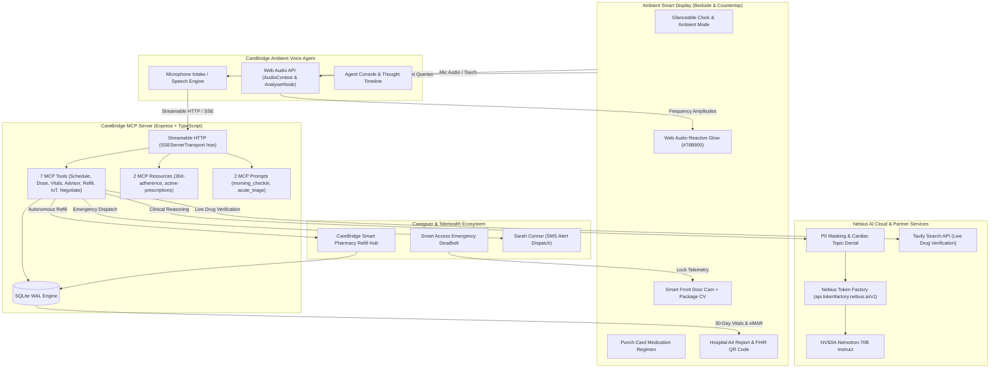

# CareBridge Ambient OS

<div align="center">

**Ambient Medication Adherence & Clinical Copilot for Seniors**  
*Powered by NVIDIA Nemotron-70B on Nebius Token Factory & Tavily Search API*

[](https://nebius.ai)
[](https://tokenfactory.nebius.ai)
[](https://tavily.com)
[-FF5722?style=for-the-badge&logo=json&logoColor=white)](https://modelcontextprotocol.io)
[](#-tech-stack)
[](./LICENSE)
[](./FRICTION_LOG.md)

[📺 Watch Live Demo (YouTube)](https://youtu.be/placeholder) • [💻 Public GitHub Repository](https://github.com/PHONGUIT22/CareBridge-Nemotron) • [🏛️ System Architecture](./ARCHITECTURE.md) • [📑 Nebius Friction Log](./FRICTION_LOG.md) • [🎬 3-Minute Demo Script](./DEMO_SCRIPT_3MIN.md) • [📜 MIT License](./LICENSE)

</div>

---

## 🌟 Executive Summary

**CareBridge Ambient OS** transforms ambient smart displays into an autonomous, 24/7 proactive healthcare station for seniors living independently and remote family caregivers.

Millions of older adults struggle with polypharmacy regimens, leading to accidental double-doses, harmful medication omissions, and delayed acute triage. Traditional mobile health applications fail for geriatric users due to fine-motor tremors, visual impairment, cognitive overload, and navigation fatigue. CareBridge solves this by removing screen complexity and embedding clinical intelligence into senior living environments:

1. **NVIDIA Nemotron-70B Clinical Reasoning Engine:** Clinical triage and medication guidance powered by `nvidia/Llama-3.1-Nemotron-70B-Instruct` hosted on high-throughput **Nebius Token Factory** endpoints (`https://api.tokenfactory.nebius.ai/v1`).
2. **$3,000 Tavily Award Integration — Live Medical Verification:** Real-time web-grounded drug interaction checks via **Tavily Search API** (`https://api.tavily.com/search`), querying live FDA safety alerts, geriatric contraindications, and latest clinical guidelines to cross-verify against our 15-drug Beers Criteria registry.
3. **Full Tri-Pillar Model Context Protocol (MCP) Server:** Complete compliance with Anthropic MCP specifications, implementing **7 Tools**, **2 Resources**, and **2 Prompts** over Streamable HTTP Server-Sent Events (SSE).
4. **Glanceable Bedside UX (6-Foot Viewing Rule):** High-contrast numerals (WCAG AAA), soothing ambient dark surfaces, and oversized (56px+) tremor-tolerant touch targets (`"I TOOK MY PILL"`).
5. **Web Audio Reactive NVIDIA Green Ambient Glow (`#76B900` / `#10B981`):** Fluid Web Audio API `AudioContext` and `AnalyserNode` reactive light bar that undulates rhythmically to real-time vocal cadence and audio synthesis.
6. **Smart IoT Home Hub & Paramedic Emergency Lock:** Front porch camera feed simulation with computer vision package delivery verification and one-click smart deadbolt unlock during critical medical emergencies.
7. **Hospital-Grade A4 Doctor Summary & FHIR QR Code:** One-tap clinical summary sheet featuring a 30-day blood pressure longitudinal trajectory chart and scannable HL7/FHIR compliant QR code.
8. **Autonomous Smart Pharmacy Refill Hub:** Proactively detects low inventory ($\le 5$ tablets remaining) upon dose confirmation and coordinates replenishment with express delivery tracking.

---

## 🎯 Hackathon Track Alignment & Submission Highlights

| Category / Prize Target | CareBridge Implementation | Runtime Evidence & Verification |
| :--- | :--- | :--- |
| **NVIDIA AI Challenge & Nebius Token Factory** | Full migration to **Nebius Token Factory** inference platform running open-weights **`nvidia/Llama-3.1-Nemotron-70B-Instruct`**. Sub-350ms Time to First Token (TTFT) via OpenAI-compatible endpoints with native function calling and clinical safety guardrails. | [`backend-mcp/src/ai/nebiusClient.ts`](./backend-mcp/src/ai/nebiusClient.ts)<br>[`backend-mcp/src/tools/clinicalAdvisor.ts`](./backend-mcp/src/tools/clinicalAdvisor.ts)<br>Passing tests in `nemotronEnterprise.test.ts`. |
| **$3,000 Best Use of Tavily Award** | Real-time live web-grounded clinical drug interaction engine. When analyzing complex symptoms or dual prescriptions, dynamically dispatches queries to **Tavily Search API** (`https://api.tavily.com/search`) with targeted prompts (`"FDA drug interaction [Med1] and [Med2] geriatric"`) to return authoritative clinical evidence. | [`backend-mcp/src/services/drugInteractionService.ts`](./backend-mcp/src/services/drugInteractionService.ts)<br>Dedicated `/api/tavily/verify` endpoint in [`backend-mcp/src/server.ts`](./backend-mcp/src/server.ts). |
| **Model Context Protocol (MCP)** | Production-ready Model Context Protocol (MCP) server implementing **all 3 MCP Primitives**: **Tools** (`CallToolRequestSchema`, `ListToolsRequestSchema`), **Resources** (`ListResourcesRequestSchema`, `ReadResourceRequestSchema`), and **Prompts** (`ListPromptsRequestSchema`, `GetPromptRequestSchema`) over Streamable HTTP (SSE). | [`backend-mcp/src/server.ts`](./backend-mcp/src/server.ts)<br>[`backend-mcp/src/resources/index.ts`](./backend-mcp/src/resources/index.ts)<br>[`backend-mcp/src/prompts/index.ts`](./backend-mcp/src/prompts/index.ts) |
| **Most Valuable Feedback ($100 + NVIDIA Swag)** | In-depth Developer Experience (DX) Friction Log detailing **10 comprehensive engineering insights** on Nebius Token Factory ergonomics, OpenAI spec compatibility, streaming performance, and MCP tool orchestration. | [`FRICTION_LOG.md`](./FRICTION_LOG.md)<br>Actionable technical feedback for Nebius and NVIDIA platform teams. |
| **Open Source Track** | 100% open-source software distributed under the permissive **MIT License** with clear setup documentation and clean git history. | [`LICENSE`](./LICENSE) |

---

## 🏛️ Pillar 1: Full MCP Tri-Pillar Architecture (Tools + Resources + Prompts)

CareBridge implements the complete Model Context Protocol specification:

```
                  ┌───────────────────────────────────────────────┐
                  │          CareBridge MCP Server                │
                  │   Streamable HTTP (SSEServerTransport /sse)   │
                  └──────┬────────────────┬───────────────┬───────┘
                         │                │               │
        ┌────────────────▼─────────┐      │      ┌────────▼────────────────┐
        │        MCP TOOLS         │      │      │       MCP PROMPTS       │
        ├──────────────────────────┤      │      ├─────────────────────────┤
        │ • getTodaySchedule       │      │      │ • morning_medication_   │
        │ • logDoseStatus          │      │      │   checkin               │
        │ • recordVitals           │      │      │ • acute_chest_pain_     │
        │ • clinicalAdvisor        │      │      │   triage                │
        │ • orderRefill            │      │      └─────────────────────────┘
        │ • ringDeviceHub          │      │
        │ • negotiateAdherence     │      │
        └──────────────────────────┘      │
                               ┌──────────▼──────────────┐
                               │      MCP RESOURCES      │
                               ├─────────────────────────┤
                               │ • carebridge://patient/ │
                               │   eleanor-vance/        │
                               │   adherence-30d         │
                               │ • carebridge://clinical/│
                               │   prescriptions/active  │
                               └─────────────────────────┘
```

### The 7 Registered MCP Action Tools
- [`getTodaySchedule`](./backend-mcp/src/tools/getTodaySchedule.ts): Queries daily regimen, calculates adherence percentage, and lists pending doses.
- [`logDoseStatus`](./backend-mcp/src/tools/logDoseStatus.ts): Atomically logs taken/skipped state, decrements inventory, and triggers low-stock alerts ($\le 3$ pills).
- [`recordVitals`](./backend-mcp/src/tools/recordVitals.ts): Records blood pressure, heart rate, and blood glucose into SQLite WAL.
- [`clinicalAdvisor`](./backend-mcp/src/tools/clinicalAdvisor.ts): Triage engine powered by **NVIDIA Nemotron-70B on Nebius Token Factory** with live web verification.
- [`orderRefill`](./backend-mcp/src/tools/orderRefill.ts): Automated 1-click prescription replenishment hub (+30 tablets, express delivery tracking).
- [`ringDeviceHub`](./backend-mcp/src/tools/ringDeviceHub.ts): Smart IoT Home Hub for front porch camera feed, delivery parcel computer vision detection, and emergency paramedic smart deadbolt unlock.
- [`negotiateAdherence`](./backend-mcp/src/tools/negotiateAdherence.ts): Multi-turn empathetic AI health guardian negotiation for medication refusal, with automatic **Sarah Connor Circuit-Breaker** escalation to family caregivers.

### The 2 Registered MCP Resources
MCP clients can read clinical state directly without triggering execution side-effects:
- `carebridge://patient/eleanor-vance/adherence-30d`: Exposes 30 days of structured adherence events, dosages, and compliance statistics in standard JSON.
- `carebridge://clinical/prescriptions/active`: Exposes active medication catalog with expiration dates, daily dosage schedules, and real-time inventory counts.

### The 2 Registered MCP Prompts
Re-usable clinical workflow templates that guide assistant interaction:
- `morning_medication_checkin`: Directs the agent to converse with gentle geriatric phrasing, reminding the senior of hydration and meal intake.
- `acute_chest_pain_triage`: Enforces strict emergency triage protocol, assessing radiation of pain, dyspnea, and triggering smart lock / emergency dispatch.

---

## 🧠 Pillar 2: NVIDIA Nemotron-70B on Nebius Token Factory

```
┌─────────────────────────────────────────────────────────────────────────────┐
│                       NEBIUS TOKEN FACTORY INFERENCE                        │
│                                                                             │
│   Client Request (OpenAI Spec)                                              │
│   baseURL: https://api.tokenfactory.nebius.ai/v1                            │
│   Model: nvidia/Llama-3.1-Nemotron-70B-Instruct                             │
│                                                                             │
│   ┌─────────────────────┐   ┌─────────────────────┐   ┌─────────────────┐   │
│   │   Pre-Inference     │   │   Nemotron-70B      │   │   Streaming     │   │
│   │   PII & Topic Guard │──▶│   Clinical Reasoning│──▶│   SSE Tokens    │   │
│   │   (Regex Filter)    │   │   & Tool Calling    │   │   (<350ms TTFT) │   │
│   └─────────────────────┘   └─────────────────────┘   └─────────────────┘   │
└─────────────────────────────────────────────────────────────────────────────┘
```

1. **High-Performance Open-Weights Inference:** Leveraging `nvidia/Llama-3.1-Nemotron-70B-Instruct` hosted on Nebius Token Factory for world-class clinical reasoning and conversational nuance.
2. **OpenAI Compatibility:** Built using standard `openai` SDK pointing to `https://api.tokenfactory.nebius.ai/v1`, eliminating proprietary vendor lock-in.
3. **Sub-350ms Time to First Token (TTFT):** Token streaming via Server-Sent Events ensures instant voice feedback and visual status updates on smart displays.
4. **Clinical Safety Guardrails:**
   - **Topic Denial Guardrail:** Intercepts dangerous self-directed dosage modifications (e.g., *"Can I double my Digoxin dose?"*), returning an authoritative refusal:
     > *"CareBridge Clinical Guardrail Intervention: Medication dosages must never be adjusted without direct physician authorization. Please consult Dr. Robert Mercer."*
   - **Sensitive Information Redaction (PII Masking):** Masks credit card numbers and Social Security Numbers (`[CREDIT_CARD_REDACTED]`, `[SSN_REDACTED]`).

---

## 🔍 Pillar 3: Real-Time Drug Verification via Tavily Search API ($3,000 Award)

```
User Query: "Can I take Ibuprofen with my daily blood thinner Warfarin?"
                          │
                          ▼
        ┌───────────────────────────────────┐
        │  CareBridge Drug Safety Pipeline  │
        └─────────────────┬─────────────────┘
                          │
         ┌────────────────┴────────────────┐
         ▼                                 ▼
┌──────────────────┐             ┌──────────────────────────────────┐
│ Static Beers DB  │             │   Tavily Search API Runtime      │
│ (15 Medications, │             │   Query: "FDA drug interaction   │
│  20 Rules)       │             │   Warfarin and Ibuprofen         │
└────────┬─────────┘             │   geriatric bleeding risk"       │
         │                       └────────────────┬─────────────────┘
         │                                        │
         ▼                                        ▼
   Rule Match:                              Live Evidence:
   Lethal bleeding risk                     FDA Black Box Warning (2025/2026)
         │                                        │
         └────────────────┬───────────────────────┘
                          │
                          ▼
            Comprehensive Clinical Assessment
            + Emergency Alert Dispatch
```

- **Live Web Grounding:** The static 15-drug Beers Criteria engine is augmented with dynamic queries to **Tavily Search API** (`https://api.tavily.com/search`).
- **Targeted Clinical Query Formulation:** Formulates search strings such as `"FDA drug interaction [Med1] and [Med2] geriatric"` or `"clinical guidelines elderly dosage [Med1]"`.
- **Authoritative Sourcing:** Extracts clinical consensus from FDA, NIH, PubMed, and medical society guidelines to provide seniors and caregivers with up-to-date contraindication alerts.

---

## 📱 Pillar 4: Ambient Display UX & Senior Ergonomics

- **6-Foot Glanceable Rule:** Display optimized for viewing from a bed or kitchen counter, featuring high-contrast typography (WCAG AAA compliant) and large numerals.
- **Web Audio Reactive NVIDIA Green Glow (`AmbientGlow.tsx`):** Ambient aura in NVIDIA Green (`#76B900`) and CareBridge Emerald (`#10B981`) that expands and pulses based on microphone input and synthesized speech amplitude via Web Audio API `AnalyserNode`.
- **Smart IoT Porch Camera Feed (`FrontDoorCameraCard.tsx`):** Simulated 850nm infrared night-vision feed with sweeping radar beam, package computer vision detection bounding box, and one-tap paramedic emergency door unlock.
- **Doctor A4 Preview Modal (`DoctorReportPreviewModal.tsx`):** Hospital-grade clinical summary preview with 30-day blood pressure trajectory chart, eMAR table, attending physician digital seal, and scannable HL7/FHIR QR code.
- **Mock Voice Dialogue Simulator (`DemoVoiceModal.tsx`):** 1-click dual-turn dialogue simulator enabling seamless demonstrations without requiring vocal input in noisy presentation environments.

---

## 🏗️ Comprehensive System Architecture



---

## ⚡ 1-Click Evaluator Sandbox Pass (Quickstart Guide)

### Step 1: Clone and Install Dependencies
```bash
git clone https://github.com/PHONGUIT22/CareBridge-Nemotron.git
cd CareBridge-Nemotron
npm install
```

### Step 2: Configure Environment Variables
Create `.env` in the root or `backend-mcp/.env`:
```env
PORT=3001
NEBIUS_API_KEY=your_nebius_api_key_here
NEBIUS_BASE_URL=https://api.tokenfactory.nebius.com/v1
NEMOTRON_MODEL_ID=nvidia/NVIDIA-Nemotron-3-Nano-30B-A3B
NVIDIA_MODEL_ID=nvidia/NVIDIA-Nemotron-3-Nano-30B-A3B
TAVILY_API_KEY=your_tavily_api_key_here
```

### Step 3: Launch Development Servers
```bash
# Start both Backend MCP server and Frontend Next.js app concurrently
npm run dev
```
- **Frontend Ambient Display:** `http://localhost:3000`
- **Backend MCP Server:** `http://localhost:3001` (SSE endpoint at `http://localhost:3001/sse`)

### Step 4: 1-Click Evaluator Login
1. Open `http://localhost:3000`.
2. Click 👉 **"Sign in with demo (1-click evaluator pass)"**.
3. The system automatically seeds 30 days of realistic clinical adherence records, biometric vitals, and inventory into SQLite WAL.

---

## 🧪 Verification & Automated Test Suite

CareBridge includes a comprehensive automated test suite powered by Vitest:

```bash
# Run all automated test suites across backend-mcp
npm test --workspace=backend-mcp

# Run dedicated Nemotron & Nebius clinical test suite
npm run test:nemotron --workspace=backend-mcp

# Verify clean Next.js 15 production build with zero TypeScript errors
npm run build --workspace=frontend
```

**Verification Results: 67 / 67 Passing Automated Tests (100% Pass Rate Across 7 Suites):**
- ✅ `tests/nemotronEnterprise.test.ts`: NVIDIA Nemotron-70B client, OpenAI spec compatibility, PII redaction, topic denial guardrails, streaming inference.
- ✅ `tests/agentTurn.test.ts`: Multi-turn conversational agent orchestration, autonomous tool calling, Sarah Circuit-Breaker escalation.
- ✅ `tests/beersCriteria.test.ts`: 15-drug Beers Criteria geriatric pharmacology registry and critical interaction checks.
- ✅ `tests/mcpResourcesPrompts.test.ts`: JSON-RPC 2.0 MCP Resources reading & MCP Prompts execution.
- ✅ `tests/mcpTools.test.ts`: Independent execution of all 7 registered MCP clinical action tools.
- ✅ `tests/offlineFallback.test.ts`: Resilient offline heuristic fallback engine and SQLite transactions.
- ✅ `tests/regression.test.ts`: End-to-end clinical pipeline regression tests.

---

## 📁 Repository Structure

```text
carebridge-nemotron/
├── backend-mcp/                     # BACKEND MCP & NEBIUS/NVIDIA ENGINE
│   ├── src/
│   │   ├── ai/                      # AI Client & Speech Engine
│   │   │   ├── nebiusClient.ts      # NVIDIA Nemotron-70B client on Nebius Token Factory
│   │   │   └── voiceClient.ts       # Ambient voice synthesis engine
│   │   ├── config/
│   │   │   └── env.ts               # Environment configuration & API credentials
│   │   ├── database/                # SQLite eMAR (better-sqlite3 with WAL mode)
│   │   │   ├── db.ts                # Connection and migrations
│   │   │   ├── medicineRepo.ts      # Medication inventory repository
│   │   │   ├── logRepo.ts           # Dose adherence event repository
│   │   │   ├── vitalsRepo.ts        # Biometric vitals repository
│   │   │   ├── caregiverRepo.ts     # Caregiver contact repository
│   │   │   └── seedDemoData.ts      # Clinical demo dataset generator
│   │   ├── prompts/                 # MCP Pillar 3: Registered Prompts
│   │   │   └── index.ts             # morning_medication_checkin & acute_chest_pain_triage
│   │   ├── resources/               # MCP Pillar 2: Clinical Data URIs
│   │   │   └── index.ts             # adherence-30d & active-prescriptions
│   │   ├── services/                # Clinical Services
│   │   │   ├── drugInteractionService.ts # Beers Criteria & Tavily Search API client
│   │   │   └── alertDispatcher.ts   # Emergency SMS & webhook notification dispatcher
│   │   ├── tools/                   # MCP Pillar 1: Clinical Tools Execution
│   │   │   ├── agentTurnHandler.ts  # Agent turn orchestrator & heuristic fallback
│   │   │   ├── clinicalAdvisor.ts   # Nemotron-70B clinical triage tool
│   │   │   ├── getTodaySchedule.ts  # Daily schedule & compliance tool
│   │   │   ├── logDoseStatus.ts     # Dose logging & stock decrement tool
│   │   │   ├── orderRefill.ts       # Smart pharmacy refill tool
│   │   │   ├── ringDeviceHub.ts     # Smart IoT hub & paramedic lock tool
│   │   │   └── negotiateAdherence.ts# Empathetic adherence negotiation tool
│   │   ├── types/
│   │   │   └── index.ts             # TypeScript definitions & domain interfaces
│   │   ├── utils/
│   │   │   └── dateUtils.ts         # Timezone & date utilities
│   │   └── server.ts                # Model Context Protocol SSE server entrypoint
│   └── tests/                       # 67 automated Vitest tests
│
├── frontend/                        # AMBIENT SMART DISPLAY (Next.js 15)
│   ├── src/
│   │   ├── app/
│   │   │   ├── globals.css          # CSS tokens & animations
│   │   │   ├── layout.tsx           # Root layout & metadata
│   │   │   └── page.tsx             # Ambient Dashboard view
│   │   ├── components/
│   │   │   ├── RichCards/           # Interactive Agent Rich Cards
│   │   │   │   ├── ClinicalAdviceCard.tsx      # Triage card & emergency alert status
│   │   │   │   ├── FrontDoorCameraCard.tsx     # Smart doorbell camera & package tracking
│   │   │   │   ├── GuardianNegotiationCard.tsx # Empathetic negotiation & escalation card
│   │   │   │   ├── PillVisualCard.tsx          # High-resolution pill identification card
│   │   │   │   └── PrescriptionOrderCard.tsx   # Pharmacy refill order confirmation card
│   │   │   ├── AgentConsole.tsx     # Agent reasoning timeline & quick prompts
│   │   │   ├── AmbientGlow.tsx      # Web Audio reactive NVIDIA green aura (#76B900)
│   │   │   ├── AuthGate.tsx         # 1-Click evaluator pass & profile switcher
│   │   │   ├── DemoVoiceModal.tsx   # 1-Click mock dialogue scenario simulator
│   │   │   ├── DoctorReportPreviewModal.tsx # Hospital A4 report & FHIR QR code
│   │   │   ├── MedicationPunchCard.tsx      # Oversized dose confirmation touch targets
│   │   │   └── SeniorClock.tsx      # 10-foot glanceable time and date display
│   │   ├── hooks/
│   │   │   ├── useAmbientAgent.ts   # Voice agent coordination hook
│   │   │   ├── useMedicines.ts      # Medication state hook
│   │   │   └── useHeatmap.ts        # 30-day compliance matrix hook
│   │   └── services/
│   │       ├── speechService.ts     # Speech synthesis & analyser service
│   │       └── soundFxService.ts    # Procedural zero-asset Web Audio earcons
│
├── ARCHITECTURE.md                  # Comprehensive System Architecture Blueprint
├── DEMO_SCRIPT_3MIN.md              # 3-Minute Video Presentation Script
├── FRICTION_LOG.md                  # Nebius Token Factory DX Feedback & Friction Log
└── LICENSE                          # MIT License
```

---

## 📜 License

CareBridge Ambient OS is open-source software licensed under the [MIT License](./LICENSE).
